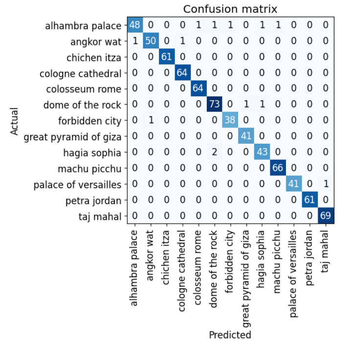
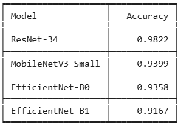

# Historical-Architectural-Landmark-Recognizer
## Project Overview  

An image classification model that leverages data collection, augmentation, model training, dataset cleaning, deployment, and API integration to recognize 13 famous historical and architectural landmarks. The landmarks are :
- Angkor Wat (Cambodia)   
- The Forbidden City (China)   
- Taj Mahal (🇮🇳 India)  
- Cologne Cathedral (Germany)   
- Petra (Jordan)   
- Dome of the Rock (Jerusalem)   
- Hagia Sophia (Türkiye)   
- Alhambra (Spain)   
- Palace of Versailles (France)   
- Colosseum (Italy)   
- Great Pyramid of Giza (Egypt)   
- Machu Picchu (Peru)   
- Chichen Itza (Mexico) 

##  Dataset Preparation
1. **Data Collection**  
   - Images of 13 famous historical and architectural landmarks are collected using DuckDuckGo Image Search 
   - Each landmark is assigned to its own folder in the [`data/`](./data/) directory

2. **Data Cleaning & Verification**  
   - The downloaded images are verified 
   - Then any failed downloads are removed 

3. **DataLoader**  
   - DataBlock is created to organize the dataset by images and their corresponding labels
   - The dataset is split into 90% training and 10% validation
   - Initial image resize: **128×128 pixels**.
   - Final augmentation resize: **224×224 pixels**.
   
4. **Data Augmentation**
	- Data augmentation is applied to increase variety in the training data
	- RandomResizedCrop(224, min_scale=0.5) is used which randomly crops and resizes the images to 224×224 pixels

 The final dataset has 3.5K+ images of 13 different classes. Details on data preparation can be found in data_prep.ipynb 
 
5. **Training and Data Cleaning**
- The model is trained using ResNet34 as base model and fine tuned for 3 epochs. After data cleaning the model is retrained for 3 epochs achieving accuracy of 98.2%
- Three other models: EfficientNet B0, EfficientNet B1 and MobileNet V3 Small are used for comparison. We are testing a (ResNet) against modern, efficient alternatives to find the best fit for our project.
- ResNet-34 performed best for our case because it has a larger capacity to learn complex patterns.
confusion image
 
**Confusion Matrix:**  

**Model Comparison:**  

Details can be found from [Training and Data Cleaning Notebook](./notebooks/training_and_data_cleaning.ipynb)
6. **Model Deployment**
   - The model is deployed to HuggingFace Spaces Gradio App. The implementation can be found in [deployment folder](./deployment) or [here](https://huggingface.co/spaces/atquiyaoni/landmark-recognizer).
**Recognizing Machu Picchu**

7. **API integration with GitHub Pages**
The deployed model API is integrated [here](https://atquiya-labiba.github.io/Historical-Architectural-Landmark-Recognizer/) in GitHub Pages Website. Implementation and other details can be found in [docs](./docs) folder.
