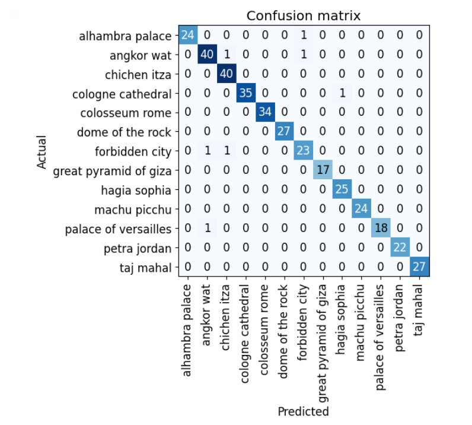
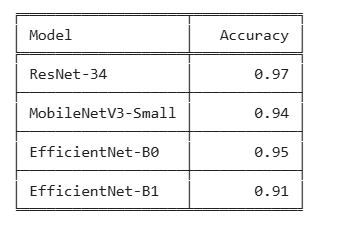
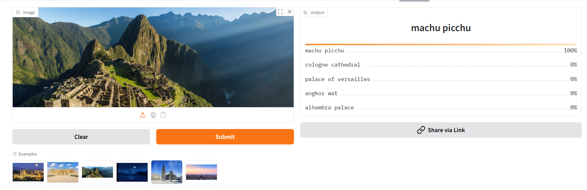
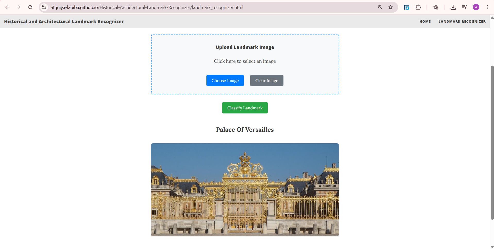

# Historical-Architectural-Landmark-Recognizer
## Project Overview  

An image classification model that leverages data collection, augmentation, model training, dataset cleaning, deployment, and API integration to recognize 13 famous historical and architectural landmarks. The landmarks are :
- Angkor Wat (Cambodia)   
- The Forbidden City (China)   
- Taj Mahal (India)  
- Cologne Cathedral (Germany)   
- Petra (Jordan)   
- Dome of the Rock (Jerusalem)   
- Hagia Sophia (Türkiye)   
- Alhambra (Spain)   
- Palace of Versailles (France)   
- Colosseum (Italy)   
- Great Pyramid of Giza (Egypt)   
- Machu Picchu (Peru)   
- Chichen Itza (Mexico) 


## Data Collection & Preprocessing
   - A total of 3,686 images were collected using DuckDuckGo Image Search, covering 13 famous historical and architectural landmarks
   - Each landmark is assigned to its own folder in the [data/](./data/) directory
   - All downloaded images were checked to ensure they were valid and not corrupted
   - Any failed images detected during verification were automatically removed from the dataset 
   - DataBlock is created to organize the dataset by images and their corresponding labels
   - The dataset is split into 90% training and 10% validation
   - Initial image resize: **128×128 pixels**.
   - Final augmentation resize: **224×224 pixels**.
   
## Data Augmentation
- Data augmentation is applied to increase variety in the training data
- RandomResizedCrop(224, min_scale=0.5) is used which randomly crops and resizes the images to 224×224 pixels

 After cleaning and removing failed images,the final dataset has 3,543 images of 13 different classes. Details on data preparation can be found [here](./notebooks/data_prep.ipynb) 
 
## Training and Data Cleaning
- The model is trained using ResNet34 as base model and fine tuned for 3 epochs. After data cleaning the model is retrained for 3 epochs achieving accuracy of 97%
- Three other models: EfficientNet B0, EfficientNet B1 and MobileNet V3 Small are used for comparison. 
- ResNet-34 performed best in our case because its capacity allows it to learn complex patterns effectively, even from a relatively small dataset, while remaining stable and less prone to underfitting compared to the other models.
### Confusion Matrix for ResNet-34 Model   
   <p align="center">
     
   </p> 
   <p align="center">
  <em> Confusion Matrix for ResNet-34 Model</em>
  </p>
   
### Model Comparison
Three additional models—EfficientNet-B0, EfficientNet-B1, and MobileNet V3 Small—were also trained and evaluated. However, ResNet-34 achieved the best overall performance.
   <p align="center">
     
   <p align="center">
  <em>Accuracy comparison across ResNet-34, EfficientNet-B0, EfficientNet-B1, and MobileNet V3 Small</em>
  </p>
	   
Details can be found from [Training and Data Cleaning Notebook](./notebooks/training_and_data_cleaning.ipynb)

## Model Deployment
The model is deployed to HuggingFace Spaces Gradio App. The implementation can be found in [deployment folder](./deployment) or [here](https://huggingface.co/spaces/atquiyaoni/landmark-recognizer)

### Recognizing Machu Picchu
<p align="center">
	

## API integration with GitHub Pages
The deployed model API is integrated [here](https://atquiya-labiba.github.io/Historical-Architectural-Landmark-Recognizer/) in GitHub Pages Website. Implementation and other details can be found in [docs](./docs) folder.

### Recognizing Palace Of Versailles via API
<p align="center">
     
   <p align="center">  
  </p>

## Build from Source
### Clone the repo
```bash
git clone https://github.com/Atquiya-Labiba/Historical-Architectural-Landmark-Recognizer.git
cd Historical-Architectural-Landmark-Recognizer
```
### Initialize and activate virtual environment
```bash
python -m venv venv
venv\Scripts\activate 
```
### Installing PyTorch 
**GPU installation :**
```bash
pip3 install torch torchvision torchaudio --index-url https://download.pytorch.org/whl/cu121
```
Replace cu121 with the CUDA version that matches your system.

 **CPU-only installation**
```bash
pip3 install torch torchvision torchaudio
```
### Verifying PyTorch device
Run the following code to verify installation
```bash
import torch

print(torch.cuda.is_available())
```
If the output is True, then PyTorch is successfully set up to use the GPU.

### Install Other Dependencies
```bash
pip3 install fastai fastbook nbdev gradio
```
